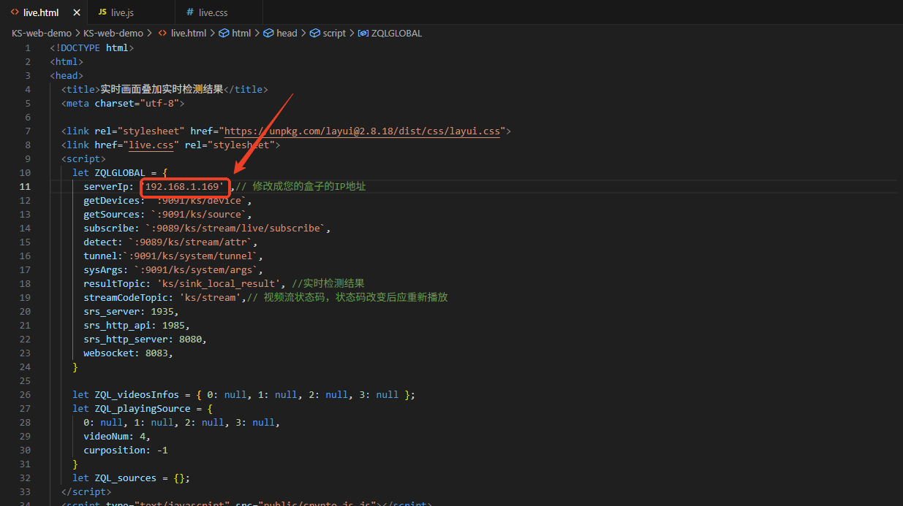
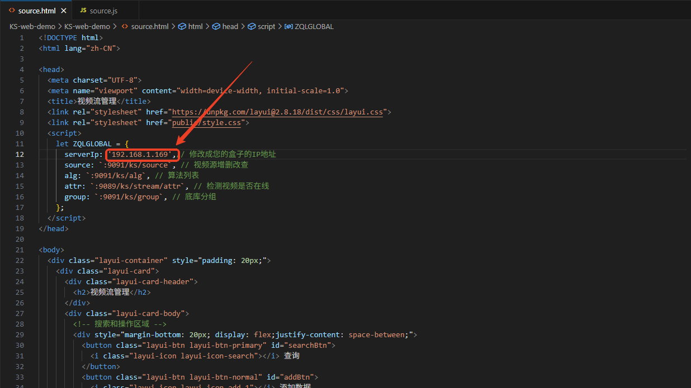
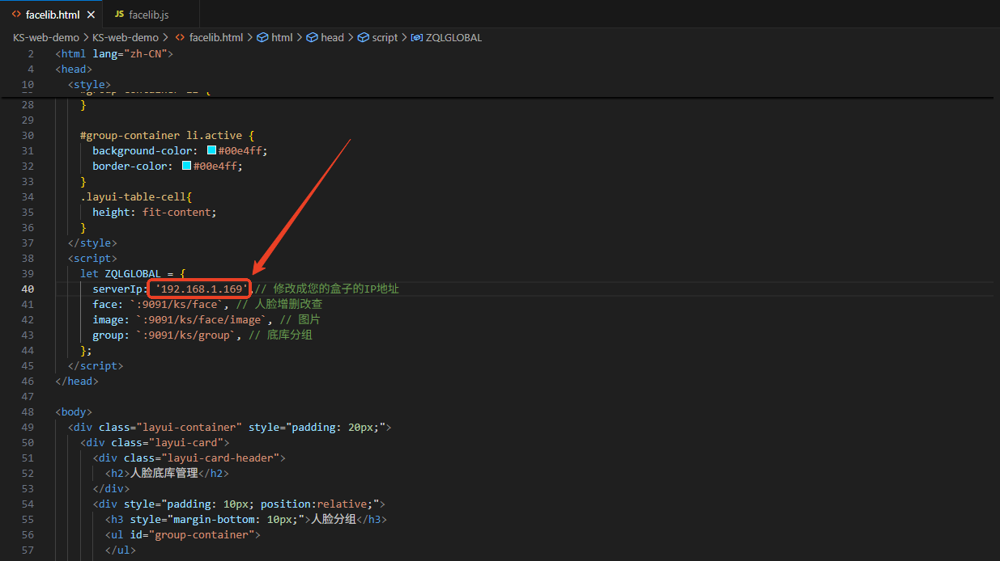
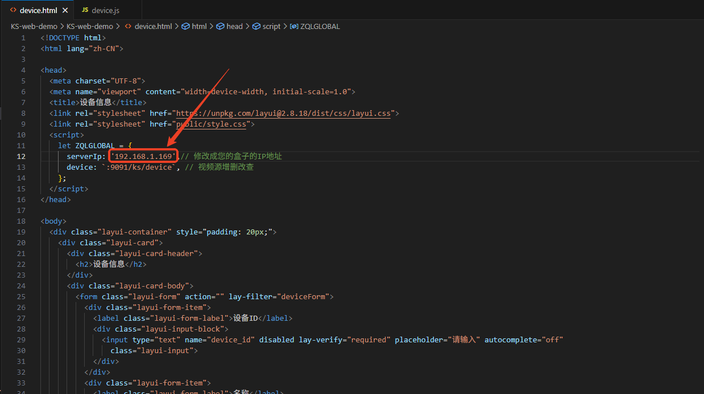

# 晓知精灵（KS）二次开发示例代码
本工程是晓知精灵（KS）全系列产品的二次开发接口示例代码，目标是帮助二开人员更便捷的完成设备的二次开发，同样也为了降低我司的售后成本，所以将所有重要的**使用设备接口的可直接运行的**源代码开放出来。工程总共包含几个模块，快速接收设备告警、深度对接设备接口 和 心跳保活。

**声明**：由于全部样例代码均已开源且可直接运行，可极大方便二次开发，用户可直接copy，稍加改动，即可完成二开。我司仅对提供出来的demo代码负责，默认情况下，售后不支持任何**帮看代码**。

## 快速接收设备告警
### http-server-demo 以HTTP协议接收设备告警（最常用）
参考具体文件下的源代码demo即可。
### tcp-server-demo 以TCP协议接收设备告警（常见PLC控制等）
参考具体文件下的源代码demo即可。
### custom-api-demo 自定义API（部分用户的平台接口规则限定了可用这个）
参考具体文件下的源代码demo即可。
## 深度对接设备接口
可将代码下载到Windows环境，用谷歌浏览器直接打开.html文件运行，内含相关功能的源代码，用户可根据我司提供的代码修改做二次开发。本工程的代码，可直接双击运行，除此之外，恕不提供其它的售后支持，见谅。
### 实时画面播放&实时检测框
live.html是实时画面播放和实时检测结果可视化的demo，将文件中的IP地址替换成KS设备的IP地址即可：

### 摄像头配置&算法绑定
source.html是视频流管理demo，将文件中的IP地址替换成KS设备的IP地址即可：

### 底库分组&人脸底库
facelib.html是底库分组管理和人脸底库增删改查的demo，将文件中的IP地址替换成KS设备的IP地址即可：

### 查看设备信息
device.html是设备信息demo，将文件中的IP地址替换成KS设备的IP地址即可：

## 心跳保活
分别提供了python和java两种语言的服务端对接KS设备心跳的demo代码。

## 接收大模型复审告警
启动main文件，在接收端创建一个server，在设备端【大模型】-【复审任务】-【结果推送】处，填上http://IP:port/vlreview  ，即可接收设备的大模型的复审告警。
